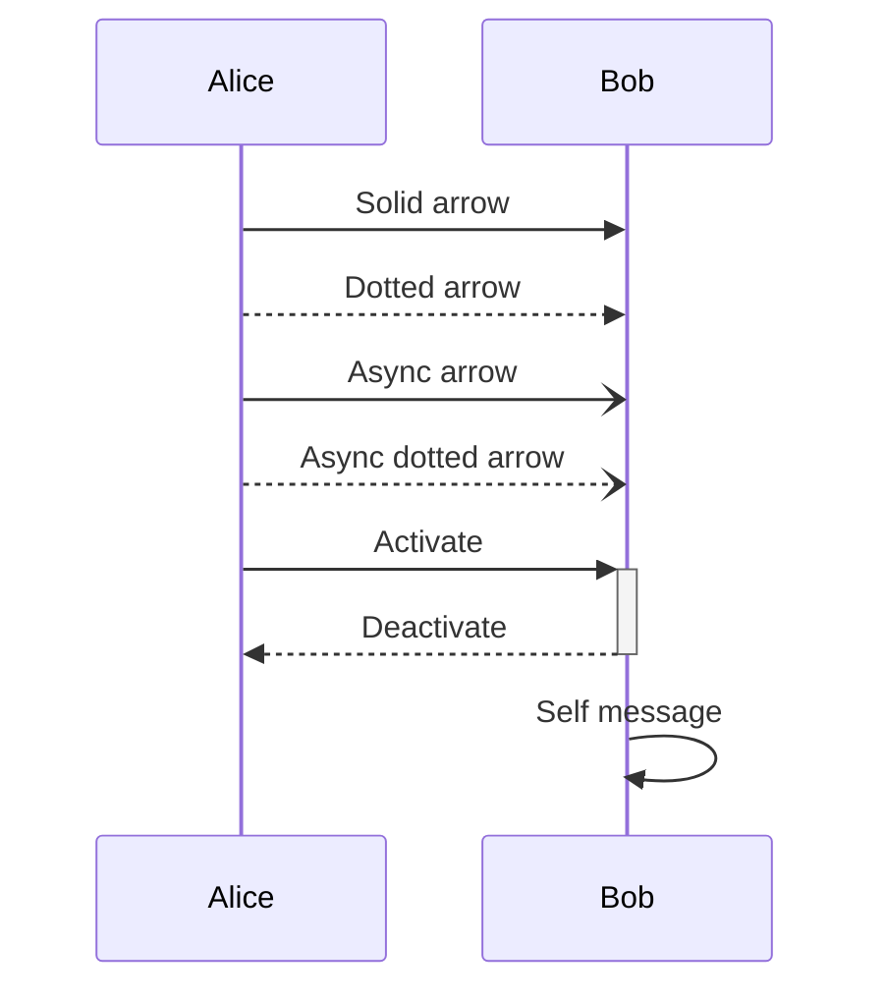
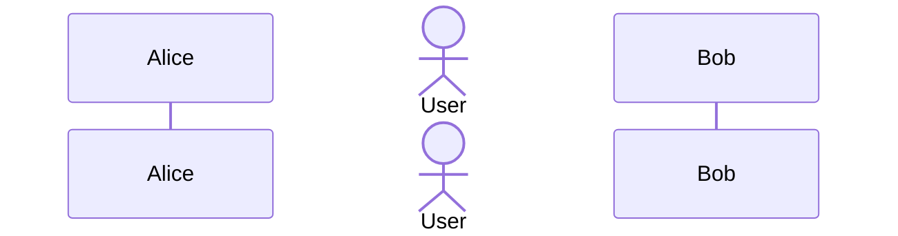
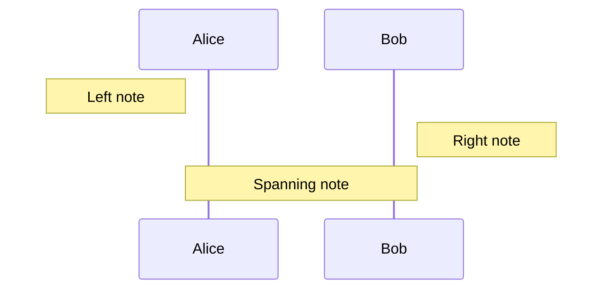
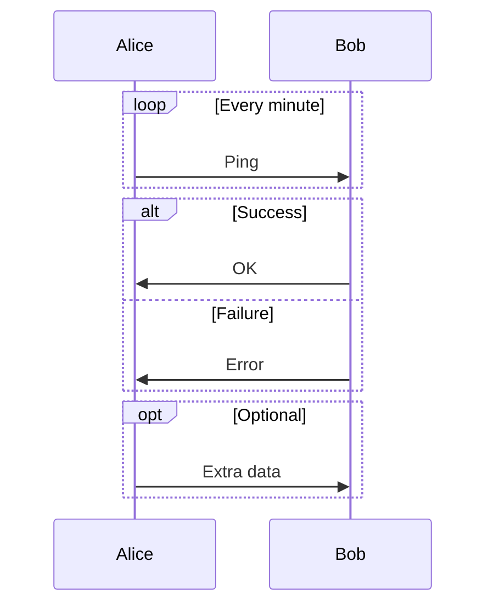

# Mermaid Self-Healing System

**Date:** 2025-11-10
**Status:** 📋 PLANNED
**Priority:** HIGH (improves AI diagram generation reliability)

---

## Overview

Implement an automatic self-healing system that detects Mermaid syntax errors in AI-generated diagrams, searches Mermaid documentation for correct syntax, and attempts to fix errors automatically before presenting diagrams to users.

---

## Problem Statement

**Current Issue:**
- AI models (GPT-5, Claude, etc.) occasionally generate invalid Mermaid syntax
- Example: `UE-)>UE` instead of `UE->>UE` (invalid arrow syntax)
- Users see "Failed to render diagram" errors
- Manual editing required to fix syntax issues

**Impact:**
- Poor user experience
- Requires technical knowledge to fix
- Breaks the "AI writes, user reviews" workflow
- Reduces trust in AI-generated diagrams

---

## Solution Architecture

### User-Controlled Iterative Healing

**Key Design Decision:** Instead of automatic healing in the background, the system presents each healing attempt to the user for approval. This allows users to:
- See what the AI is changing
- Stop if healing makes things worse
- Learn from the fixes (educational value)
- Maintain control over their diagrams

**Workflow:**
1. AI generates diagram → Syntax error detected
2. Modal appears: "Syntax error detected. Attempt automatic fix?"
3. User clicks "Try to Fix" → AI attempts fix #1
4. Modal shows: "Fix #1 applied. Still has errors. Try again?" (shows diff)
5. User can choose: "Try Again" or "Edit Manually" or "Cancel"
6. Maximum 3 iterations or until valid

### 1. Error Detection & Parsing

**Component:** `src/services/mermaid/MermaidValidator.ts` (NEW)

```typescript
export interface MermaidValidationResult {
  isValid: boolean;
  errors: MermaidSyntaxError[];
  warnings: string[];
  originalCode: string;
}

export interface MermaidSyntaxError {
  line: number;
  column: number;
  message: string;
  errorType: MermaidErrorType;
  context: string; // surrounding code lines
}

export enum MermaidErrorType {
  INVALID_ARROW = 'invalid_arrow',
  INVALID_PARTICIPANT = 'invalid_participant',
  INVALID_SYNTAX = 'invalid_syntax',
  UNKNOWN = 'unknown'
}

export class MermaidValidator {
  /**
   * Validate Mermaid code by attempting to parse it
   * Catches errors from Mermaid.js parser
   */
  static async validate(code: string): Promise<MermaidValidationResult> {
    try {
      // Use Mermaid.js parse() method (doesn't render, just validates)
      await mermaid.parse(code);
      return { isValid: true, errors: [], warnings: [], originalCode: code };
    } catch (error: any) {
      const parsedError = this.parseError(error, code);
      return {
        isValid: false,
        errors: [parsedError],
        warnings: [],
        originalCode: code
      };
    }
  }

  /**
   * Parse Mermaid error message to extract line, column, and error type
   * Example: "Parse error on line 74: ...ide UE-)>UE: Radio Link Fail"
   */
  private static parseError(error: any, code: string): MermaidSyntaxError {
    const message = error.message || error.toString();

    // Extract line number from error message
    const lineMatch = message.match(/line (\d+)/i);
    const line = lineMatch ? parseInt(lineMatch[1]) : 0;

    // Extract expected/got tokens to determine error type
    const expectingMatch = message.match(/Expecting (.+), got '(.+)'/i);

    let errorType = MermaidErrorType.UNKNOWN;
    if (message.includes('ACTOR') && message.includes('INVALID')) {
      errorType = MermaidErrorType.INVALID_ARROW;
    } else if (message.includes('participant')) {
      errorType = MermaidErrorType.INVALID_PARTICIPANT;
    } else {
      errorType = MermaidErrorType.INVALID_SYNTAX;
    }

    return {
      line,
      column: 0, // Not always available in Mermaid errors
      message,
      errorType,
      context: this.getLineContext(code, line, 2)
    };
  }

  /**
   * Get surrounding lines of code for context
   */
  private static getLineContext(code: string, line: number, contextLines: number): string {
    const lines = code.split('\n');
    const start = Math.max(0, line - contextLines - 1);
    const end = Math.min(lines.length, line + contextLines);
    return lines.slice(start, end).join('\n');
  }
}
```

### 2. Mermaid Documentation Search

**Component:** `src/services/mermaid/MermaidDocSearch.ts` (NEW)

**Approach:** Embed Mermaid documentation into the application for fast offline search.

```typescript
export interface MermaidDocEntry {
  section: string; // "sequence-diagram", "arrows", "participants", etc.
  topic: string;
  syntax: string;
  examples: string[];
  description: string;
}

export class MermaidDocSearch {
  private static docs: MermaidDocEntry[] = [
    // Sequence Diagram - Arrows
    {
      section: 'sequence-diagram',
      topic: 'arrows',
      syntax: 'Participant->>+Participant: Message',
      examples: [
        'Alice->>Bob: Hello',
        'Alice-->>Bob: Dotted arrow',
        'Alice-)Bob: Async arrow',
        'Alice--)Bob: Async dotted arrow',
        'Bob->>Bob: Self message'
      ],
      description: 'Valid arrow syntax for sequence diagrams. Use ->> for solid arrows, -->> for dotted, -) for async.'
    },
    {
      section: 'sequence-diagram',
      topic: 'participants',
      syntax: 'participant Name as Alias',
      examples: [
        'participant Alice',
        'participant Bob as B',
        'actor User',
        'participant System as S'
      ],
      description: 'Declare participants before using them in messages.'
    },
    // Add more documentation entries...
  ];

  /**
   * Search documentation for relevant entries based on error type
   */
  static search(errorType: MermaidErrorType, query?: string): MermaidDocEntry[] {
    switch (errorType) {
      case MermaidErrorType.INVALID_ARROW:
        return this.docs.filter(d => d.topic === 'arrows');
      case MermaidErrorType.INVALID_PARTICIPANT:
        return this.docs.filter(d => d.topic === 'participants');
      default:
        // General search by query
        if (query) {
          const lowerQuery = query.toLowerCase();
          return this.docs.filter(d =>
            d.description.toLowerCase().includes(lowerQuery) ||
            d.examples.some(e => e.toLowerCase().includes(lowerQuery))
          );
        }
        return [];
    }
  }

  /**
   * Get valid syntax patterns for a specific error
   */
  static getValidPatterns(errorType: MermaidErrorType): string[] {
    const entries = this.search(errorType);
    return entries.flatMap(e => e.examples);
  }
}
```

### 3. AI-Powered Self-Healing

**Component:** `src/services/mermaid/MermaidSelfHealer.ts` (NEW)

```typescript
import { AIService } from '../ai/AIService';
import { MermaidValidator, MermaidSyntaxError } from './MermaidValidator';
import { MermaidDocSearch } from './MermaidDocSearch';

export interface HealingResult {
  success: boolean;
  fixedCode?: string;
  attemptsMade: number;
  errors: string[];
  healingSteps: HealingStep[];
  requiresUserApproval: boolean; // NEW: Indicates user should review
}

export interface HealingStep {
  step: number;
  action: string;
  result: 'success' | 'failure' | 'pending-approval'; // NEW: pending-approval state
  message: string;
  originalCode?: string; // NEW: For showing diff
  proposedCode?: string; // NEW: For showing diff
  errorFixed?: string; // NEW: Description of what was fixed
}

export class MermaidSelfHealer {
  private maxAttempts = 3;
  private aiService: AIService;

  constructor(aiService: AIService) {
    this.aiService = aiService;
  }

  /**
   * Propose a single healing iteration (does NOT apply automatically)
   * Returns proposed fix for user approval
   *
   * NEW APPROACH: User-controlled healing
   * - Generates ONE fix at a time
   * - Returns proposed code for user review
   * - User decides: Accept, Try Again, or Cancel
   */
  async proposeHealingIteration(
    mermaidCode: string,
    iteration: number
  ): Promise<{
    proposedCode: string;
    error: MermaidSyntaxError;
    validExamples: string[];
    explanation: string;
  }> {
    console.log(`🔧 Proposing healing iteration ${iteration}...`);

    // Validate to find error
    const validation = await MermaidValidator.validate(mermaidCode);

    if (validation.isValid) {
      throw new Error('Code is already valid, no healing needed');
    }

    const error = validation.errors[0]; // Fix first error

    // Search documentation for correct syntax
    const docEntries = MermaidDocSearch.search(error.errorType);
    const validExamples = docEntries.flatMap(d => d.examples);

    console.log(`📚 Found ${validExamples.length} documentation examples for ${error.errorType}`);

    // Build healing prompt for AI
    const healingPrompt = this.buildHealingPrompt(mermaidCode, error, validExamples);

    // Ask AI to fix the error
    const fixResult = await this.aiService.chat(
      healingPrompt,
      [], // No history needed for healing
      { task: 'mermaid-healing' },
      { temperature: 0.1, maxTokens: 2000 } // Low temperature for precise fixes
    );

    const proposedCode = this.extractMermaidCode(fixResult.content);

    // Generate explanation for user
    const explanation = `AI proposes fixing ${error.errorType} on line ${error.line}:\n` +
      `Original: ${error.context}\n` +
      `Valid syntax examples: ${validExamples.slice(0, 3).join(', ')}`;

    return {
      proposedCode,
      error,
      validExamples,
      explanation
    };
  }

  /**
   * Validate if proposed code is actually fixed
   */
  async validateProposedFix(code: string): Promise<{
    isValid: boolean;
    stillHasErrors: boolean;
    errors: string[];
  }> {
    const validation = await MermaidValidator.validate(code);
    return {
      isValid: validation.isValid,
      stillHasErrors: !validation.isValid,
      errors: validation.errors.map(e => e.message)
    };
  }

  /**
   * Build AI prompt for healing Mermaid syntax errors
   */
  private buildHealingPrompt(code: string, error: MermaidSyntaxError, validExamples: string[]): string {
    return `You are a Mermaid diagram syntax expert. Fix the following Mermaid syntax error.

**ERROR:**
- Line ${error.line}
- Type: ${error.errorType}
- Message: ${error.message}

**INVALID CODE:**
\`\`\`mermaid
${code}
\`\`\`

**VALID SYNTAX EXAMPLES (from Mermaid documentation):**
${validExamples.map(ex => `- \`${ex}\``).join('\n')}

**INSTRUCTIONS:**
1. Identify the syntax error on line ${error.line}
2. Replace the invalid syntax with correct Mermaid syntax based on the examples above
3. Do NOT change any other parts of the diagram
4. Do NOT add explanations or comments
5. Return ONLY the corrected Mermaid code wrapped in \`\`\`mermaid code fences

**CORRECTED CODE:**`;
  }

  /**
   * Extract Mermaid code from AI response (removes markdown code fences)
   */
  private extractMermaidCode(response: string): string {
    const match = response.match(/```mermaid\n([\s\S]*?)\n```/);
    if (match) {
      return match[1].trim();
    }
    // Fallback: return response as-is if no code fence found
    return response.trim();
  }
}
```

### 4. Integration with AIService

**File:** `src/services/ai/AIService.ts` (MODIFY)

Add new method for diagram generation with self-healing:

```typescript
/**
 * Generate sequence diagram with automatic self-healing
 * If initial generation has syntax errors, attempts to fix them automatically
 */
async generateSequenceDiagramWithHealing(
  title: string,
  description: string,
  procedureContent: string,
  figureNumber: string
): Promise<{
  diagram: MermaidDiagram | null;
  errors: string[];
  warnings: string[];
  healingApplied: boolean;
  healingSteps?: HealingStep[];
}> {
  // Step 1: Generate diagram normally
  const initialResult = await this.generateSequenceDiagram(
    title,
    description,
    procedureContent,
    figureNumber
  );

  // Step 2: Validate generated code
  const validation = await MermaidValidator.validate(initialResult.mermaidCode);

  if (validation.isValid) {
    // No errors, return original result
    return {
      diagram: initialResult.diagram,
      errors: initialResult.errors,
      warnings: initialResult.warnings,
      healingApplied: false
    };
  }

  // Step 3: Attempt self-healing
  console.log('⚠️ Mermaid syntax errors detected, attempting self-healing...');

  const healer = new MermaidSelfHealer(this);
  const healingResult = await healer.heal(initialResult.mermaidCode);

  if (healingResult.success && healingResult.fixedCode) {
    // Healing successful, parse the fixed code
    const parseResult = parseMermaidDiagram(healingResult.fixedCode);

    if (parseResult.success && parseResult.data) {
      return {
        diagram: {
          ...parseResult.data,
          title,
          figureNumber,
          type: 'sequence'
        },
        errors: [],
        warnings: [
          `Original diagram had syntax errors. Automatically fixed after ${healingResult.attemptsMade} attempt(s).`
        ],
        healingApplied: true,
        healingSteps: healingResult.healingSteps
      };
    }
  }

  // Healing failed, return original errors
  return {
    diagram: null,
    errors: [
      'Failed to generate valid Mermaid diagram',
      ...healingResult.errors
    ],
    warnings: [
      `Attempted automatic fixing ${healingResult.attemptsMade} times but failed.`
    ],
    healingApplied: true,
    healingSteps: healingResult.healingSteps
  };
}
```

### 5. Create Healing Modal Component

**File:** `src/components/ai/MermaidHealingModal.tsx` (NEW)

**Purpose:** Interactive modal that guides user through healing iterations

```typescript
import React, { useState } from 'react';
import { MermaidSelfHealer } from '../../services/mermaid/MermaidSelfHealer';
import { aiService } from '../../services/ai';

interface MermaidHealingModalProps {
  isOpen: boolean;
  onClose: () => void;
  invalidCode: string;
  error: string;
  onFixed: (fixedCode: string) => void; // Callback when code is successfully fixed
  onManualEdit: () => void; // User chooses to edit manually
}

export const MermaidHealingModal: React.FC<MermaidHealingModalProps> = ({
  isOpen,
  onClose,
  invalidCode,
  error,
  onFixed,
  onManualEdit
}) => {
  const [currentCode, setCurrentCode] = useState(invalidCode);
  const [iteration, setIteration] = useState(0);
  const [isHealing, setIsHealing] = useState(false);
  const [healingResult, setHealingResult] = useState<any>(null);
  const [validationResult, setValidationResult] = useState<any>(null);

  const healer = new MermaidSelfHealer(aiService);

  const handleTryFix = async () => {
    if (iteration >= 3) {
      alert('Maximum 3 healing attempts reached. Please edit manually.');
      return;
    }

    setIsHealing(true);
    setIteration(iteration + 1);

    try {
      // Propose healing iteration
      const proposal = await healer.proposeHealingIteration(currentCode, iteration + 1);

      // Validate proposed fix
      const validation = await healer.validateProposedFix(proposal.proposedCode);

      setHealingResult(proposal);
      setValidationResult(validation);

      // If valid, user can accept immediately
      if (validation.isValid) {
        // Don't auto-apply, let user review and accept
      }
    } catch (error: any) {
      alert(`Healing failed: ${error.message}`);
    } finally {
      setIsHealing(false);
    }
  };

  const handleAcceptFix = () => {
    if (healingResult && validationResult?.isValid) {
      onFixed(healingResult.proposedCode);
      onClose();
    } else if (healingResult) {
      // Fix not valid yet, but user wants to accept and try again
      setCurrentCode(healingResult.proposedCode);
      setHealingResult(null);
      setValidationResult(null);
    }
  };

  const handleReject = () => {
    // User doesn't like this fix, reset
    setHealingResult(null);
    setValidationResult(null);
  };

  if (!isOpen) return null;

  return (
    <div className="fixed inset-0 bg-black bg-opacity-50 flex items-center justify-center z-50">
      <div className="bg-white dark:bg-gray-800 rounded-lg shadow-xl max-w-4xl w-full mx-4 max-h-[90vh] overflow-y-auto">
        {/* Header */}
        <div className="px-6 py-4 border-b border-gray-200">
          <h2 className="text-2xl font-semibold text-red-600">
            Mermaid Syntax Error Detected
          </h2>
          <p className="mt-1 text-sm text-gray-600">
            The AI-generated diagram has invalid syntax. Would you like to attempt automatic fixing?
          </p>
        </div>

        {/* Content */}
        <div className="px-6 py-4 space-y-4">
          {/* Error Display */}
          <div className="bg-red-50 border border-red-200 rounded-md p-4">
            <h3 className="text-sm font-medium text-red-900 mb-2">Original Error</h3>
            <pre className="text-xs text-red-800 whitespace-pre-wrap">{error}</pre>
          </div>

          {/* Iteration Counter */}
          <div className="flex items-center justify-between">
            <span className="text-sm text-gray-600">
              Healing Iteration: {iteration} / 3
            </span>
            {iteration > 0 && (
              <span className="text-xs text-gray-500">
                {iteration === 3 ? 'Last attempt' : `${3 - iteration} attempts remaining`}
              </span>
            )}
          </div>

          {/* Healing Result Display */}
          {healingResult && (
            <div className="border border-blue-200 rounded-md overflow-hidden">
              {/* Explanation */}
              <div className="bg-blue-50 p-4">
                <h3 className="text-sm font-medium text-blue-900 mb-2">
                  Proposed Fix #{iteration}
                </h3>
                <p className="text-sm text-blue-800 whitespace-pre-wrap">
                  {healingResult.explanation}
                </p>
              </div>

              {/* Code Diff (simplified) */}
              <div className="grid grid-cols-2 gap-4 p-4">
                <div>
                  <h4 className="text-xs font-medium text-gray-700 mb-2">Original</h4>
                  <pre className="text-xs bg-gray-100 p-2 rounded overflow-x-auto max-h-64">
                    {currentCode}
                  </pre>
                </div>
                <div>
                  <h4 className="text-xs font-medium text-gray-700 mb-2">Proposed</h4>
                  <pre className="text-xs bg-green-50 p-2 rounded overflow-x-auto max-h-64">
                    {healingResult.proposedCode}
                  </pre>
                </div>
              </div>

              {/* Validation Status */}
              {validationResult && (
                <div className={`p-4 ${validationResult.isValid ? 'bg-green-50' : 'bg-yellow-50'}`}>
                  {validationResult.isValid ? (
                    <div className="flex items-center gap-2">
                      <svg className="w-5 h-5 text-green-600" fill="none" viewBox="0 0 24 24" stroke="currentColor">
                        <path strokeLinecap="round" strokeLinejoin="round" strokeWidth={2} d="M5 13l4 4L19 7" />
                      </svg>
                      <span className="text-sm font-medium text-green-900">
                        ✅ This fix resolves the syntax error!
                      </span>
                    </div>
                  ) : (
                    <div className="flex items-start gap-2">
                      <svg className="w-5 h-5 text-yellow-600 mt-0.5" fill="none" viewBox="0 0 24 24" stroke="currentColor">
                        <path strokeLinecap="round" strokeLinejoin="round" strokeWidth={2} d="M12 9v2m0 4h.01m-6.938 4h13.856c1.54 0 2.502-1.667 1.732-3L13.732 4c-.77-1.333-2.694-1.333-3.464 0L3.34 16c-.77 1.333.192 3 1.732 3z" />
                      </svg>
                      <div>
                        <span className="text-sm font-medium text-yellow-900">
                          ⚠️ Still has errors after this fix
                        </span>
                        <ul className="text-xs text-yellow-800 mt-1 list-disc list-inside">
                          {validationResult.errors.map((err: string, idx: number) => (
                            <li key={idx}>{err}</li>
                          ))}
                        </ul>
                      </div>
                    </div>
                  )}
                </div>
              )}
            </div>
          )}

          {/* Instructions */}
          {!healingResult && iteration === 0 && (
            <div className="bg-purple-50 border border-purple-200 rounded-md p-4">
              <h3 className="text-sm font-medium text-purple-900 mb-2">How Auto-Fixing Works</h3>
              <ol className="text-sm text-purple-800 space-y-1 list-decimal list-inside">
                <li>AI searches Mermaid documentation for correct syntax</li>
                <li>AI proposes a fix based on valid examples</li>
                <li>You review the proposed fix (side-by-side comparison)</li>
                <li>You decide: Accept, Try Again (up to 3 times), or Edit Manually</li>
              </ol>
            </div>
          )}
        </div>

        {/* Footer Actions */}
        <div className="px-6 py-4 border-t border-gray-200 flex justify-end space-x-3">
          {/* Cancel */}
          <button
            onClick={onClose}
            disabled={isHealing}
            className="px-4 py-2 text-sm font-medium text-gray-700 bg-white border border-gray-300 rounded-md hover:bg-gray-50 disabled:opacity-50"
          >
            Cancel
          </button>

          {/* Edit Manually */}
          <button
            onClick={onManualEdit}
            disabled={isHealing}
            className="px-4 py-2 text-sm font-medium text-blue-700 bg-white border border-blue-300 rounded-md hover:bg-blue-50 disabled:opacity-50"
          >
            Edit Manually Instead
          </button>

          {/* Try Again (if fix didn't work) */}
          {healingResult && validationResult && !validationResult.isValid && iteration < 3 && (
            <button
              onClick={() => {
                handleAcceptFix(); // Accept partial fix and continue
                setTimeout(handleTryFix, 100); // Try again
              }}
              disabled={isHealing}
              className="px-4 py-2 text-sm font-medium text-yellow-700 bg-yellow-100 border border-yellow-300 rounded-md hover:bg-yellow-200 disabled:opacity-50"
            >
              Accept & Try Again ({3 - iteration} left)
            </button>
          )}

          {/* Accept Fix (if valid) */}
          {healingResult && validationResult?.isValid && (
            <button
              onClick={handleAcceptFix}
              disabled={isHealing}
              className="px-4 py-2 text-sm font-medium text-white bg-green-600 rounded-md hover:bg-green-700 disabled:opacity-50"
            >
              ✅ Accept Fix
            </button>
          )}

          {/* Try to Fix (initial or retry) */}
          {!healingResult && iteration < 3 && (
            <button
              onClick={handleTryFix}
              disabled={isHealing}
              className="px-4 py-2 text-sm font-medium text-white bg-purple-600 rounded-md hover:bg-purple-700 disabled:opacity-50"
            >
              {isHealing ? 'Analyzing...' : iteration === 0 ? 'Try to Fix' : 'Try Again'}
            </button>
          )}

          {/* Reject Fix (if shown but user doesn't like it) */}
          {healingResult && (
            <button
              onClick={handleReject}
              disabled={isHealing}
              className="px-4 py-2 text-sm font-medium text-red-700 bg-white border border-red-300 rounded-md hover:bg-red-50 disabled:opacity-50"
            >
              Reject This Fix
            </button>
          )}
        </div>
      </div>
    </div>
  );
};
```

### 6. Update GenerateDiagramsModal Integration

**File:** `src/components/ai/GenerateDiagramsModal.tsx` (MODIFY)

```typescript
import { MermaidHealingModal } from './MermaidHealingModal';

// Add state for healing modal
const [showHealingModal, setShowHealingModal] = useState(false);
const [healingDiagram, setHealingDiagram] = useState<{
  code: string;
  error: string;
  title: string;
} | null>(null);

// When diagram generation fails with syntax error:
const handleDiagramError = (code: string, error: string, title: string) => {
  setHealingDiagram({ code, error, title });
  setShowHealingModal(true);
};

// When healing succeeds:
const handleHealingSuccess = (fixedCode: string) => {
  // Parse and add the fixed diagram
  const parseResult = parseMermaidDiagram(fixedCode);
  if (parseResult.success && parseResult.data) {
    addMermaidDiagram('sequence', {
      ...parseResult.data,
      title: healingDiagram!.title
    });
    alert('✅ Diagram fixed and added!');
  }
  setShowHealingModal(false);
  setHealingDiagram(null);
};

// When user chooses manual edit:
const handleManualEdit = () => {
  // Navigate to sequence diagram editor with broken code
  setShowHealingModal(false);
  // TODO: Open editor with code pre-loaded
};

// Render healing modal
return (
  <>
    <GenerateDiagramsModal ... />

    <MermaidHealingModal
      isOpen={showHealingModal}
      onClose={() => setShowHealingModal(false)}
      invalidCode={healingDiagram?.code || ''}
      error={healingDiagram?.error || ''}
      onFixed={handleHealingSuccess}
      onManualEdit={handleManualEdit}
    />
  </>
);
```

---

## Implementation Plan

### Phase 1: Core Validation & Error Parsing (1-2 hours)
- [ ] Create `MermaidValidator.ts` with validation and error parsing
- [ ] Add unit tests for error parsing
- [ ] Integrate validation into existing diagram generation flow

### Phase 2: Documentation Search (2-3 hours)
- [ ] Create `MermaidDocSearch.ts` with embedded documentation
- [ ] Add documentation entries for:
  - [ ] Sequence diagram arrows (all types)
  - [ ] Participant syntax
  - [ ] Notes and rectangles
  - [ ] Loops and conditions
  - [ ] State diagram syntax
  - [ ] Flowchart syntax
- [ ] Test search functionality

### Phase 3: Self-Healing Logic (3-4 hours)
- [ ] Create `MermaidSelfHealer.ts` with healing workflow
- [ ] Implement AI-powered fixing with documentation context
- [ ] Add retry logic (max 3 attempts)
- [ ] Test with known syntax errors

### Phase 4: Integration (2 hours)
- [ ] Add `generateSequenceDiagramWithHealing()` to AIService
- [ ] Update GenerateDiagramsModal with self-healing option
- [ ] Add healing status display in UI
- [ ] Update approval workflow to show healing steps

### Phase 5: Testing & Refinement (2-3 hours)
- [ ] Test with GPT-5 generated diagrams
- [ ] Test with Claude generated diagrams
- [ ] Measure success rate (% of errors auto-fixed)
- [ ] Refine prompts and documentation based on results
- [ ] Add logging/telemetry for healing success/failure

**Total Estimated Time:** 10-14 hours

---

## Success Metrics

**Target Goals:**
- **Auto-fix rate:** 80%+ of AI-generated syntax errors fixed automatically
- **False positive rate:** <5% (healing doesn't break valid diagrams)
- **User satisfaction:** Users should rarely see raw Mermaid syntax errors

**Monitoring:**
- Track healing attempts per diagram generation
- Track healing success rate by error type
- Track user manual edits after healing (indicates healing failure)

---

## User Experience

### Before (Current):
1. User clicks "Generate Diagrams"
2. AI generates 3 sequence diagrams
3. One has syntax error: "Failed to render diagram"
4. User sees error message: "Parse error on line 74..."
5. User must manually edit Mermaid code or regenerate

### After (With Interactive Self-Healing):
1. User clicks "Generate Diagrams"
2. AI generates 3 sequence diagrams
3. One has syntax error → **Healing modal appears automatically**
4. Modal shows:
   - Original error: "Parse error on line 74: UE-)>UE expecting ACTOR"
   - Iteration counter: "0 / 3"
   - "How Auto-Fixing Works" explanation
   - Buttons: "Try to Fix" | "Edit Manually" | "Cancel"
5. User clicks "Try to Fix" → AI searches docs and proposes fix
6. Modal updates to show:
   - **Side-by-side diff** (Original vs Proposed)
   - AI explanation: "Fixing invalid_arrow on line 74"
   - Valid syntax examples: `UE->>UE`, `UE-->>UE`
   - Validation status: "✅ This fix resolves the syntax error!"
   - Buttons: "✅ Accept Fix" | "Reject This Fix" | "Edit Manually"
7. User reviews the fix and clicks "✅ Accept Fix"
8. Diagram is added to project with fixed code
9. **If fix didn't work:** User sees "⚠️ Still has errors" with option to "Accept & Try Again (2 left)"
10. **Maximum 3 iterations** or until user cancels/accepts/edits manually

### Key Benefits of Interactive Approach:
- **User Control:** See exactly what AI is changing at each step
- **Educational:** Learn correct Mermaid syntax from examples
- **Transparency:** No black-box automatic fixes
- **Fail-Safe:** User can stop if AI makes things worse
- **Flexible:** Choose to accept partial fix and continue, or edit manually

---

## Alternative Approaches Considered

### 1. **Pattern-Based Regex Replacement** (Rejected)
- **Pros:** Fast, no AI call needed
- **Cons:** Brittle, can't handle complex errors, would need hundreds of rules

### 2. **LLM Fine-Tuning** (Future Enhancement)
- **Pros:** AI generates correct syntax from the start
- **Cons:** Expensive, requires training data, model updates

### 3. **Hybrid: Regex + AI** (Recommended for Phase 2)
- **Phase 1:** AI-only healing (flexible, handles all errors)
- **Phase 2:** Add regex rules for common errors (faster, cheaper)
- **Fallback:** If regex fails, use AI healing

---

## Documentation Examples to Embed

### Sequence Diagrams

**Arrows:**


**Participants:**


**Notes:**


**Loops & Conditions:**


---

## Known Limitations

1. **Can't fix semantic errors:** Only syntax errors (e.g., can't detect if diagram doesn't match spec content)
2. **Requires AI call:** Adds latency to diagram generation (but only when errors detected)
3. **May not fix 100% of errors:** Some errors too complex or ambiguous
4. **Documentation completeness:** Only as good as our embedded docs

---

## Future Enhancements

1. **Web search for latest Mermaid docs** - Fetch from mermaid.js.org if needed
2. **User feedback loop** - Track which fixes users accept/reject
3. **Healing analytics dashboard** - Show healing success rates over time
4. **Pre-generation validation** - Check AI prompt includes Mermaid syntax guide
5. **Smart retry** - If healing fails, regenerate entire diagram with stricter prompt

---

## References

- [Mermaid Sequence Diagrams](https://mermaid.js.org/syntax/sequenceDiagram.html)
- [Mermaid State Diagrams](https://mermaid.js.org/syntax/stateDiagram.html)
- [Mermaid Flowcharts](https://mermaid.js.org/syntax/flowchart.html)
- [Mermaid Parser API](https://github.com/mermaid-js/mermaid/blob/develop/packages/mermaid/src/mermaid.ts)

---

## Related Files

- `src/services/ai/AIService.ts` - Main AI orchestration (will add healing method)
- `src/services/ai/parsers/mermaidParser.ts` - Current Mermaid parsing logic
- `src/components/ai/GenerateDiagramsModal.tsx` - UI for diagram generation
- `src/components/DiagramViewer.tsx` - Renders diagrams (shows errors)

---

## Conclusion

This **user-controlled iterative self-healing system** will significantly improve the reliability of AI-generated Mermaid diagrams while maintaining user control and transparency.

### Key Design Principles:

1. **Interactive, Not Automatic:** Each healing iteration requires user approval
2. **Transparent:** Side-by-side diff shows exactly what changed
3. **Educational:** Users learn correct Mermaid syntax from examples
4. **Fail-Safe:** User can stop at any iteration (max 3)
5. **Flexible:** Accept partial fix and retry, or edit manually

### Implementation Summary:

**Phase 1:** Validation & Error Detection (1-2 hours)
- `MermaidValidator.ts` - Parse and categorize errors

**Phase 2:** Documentation Search (2-3 hours)
- `MermaidDocSearch.ts` - Embedded Mermaid syntax reference

**Phase 3:** Self-Healing Logic (3-4 hours)
- `MermaidSelfHealer.ts` - Propose fixes (not apply automatically)

**Phase 4:** Interactive UI (4-5 hours)
- `MermaidHealingModal.tsx` - User-controlled healing workflow
- Integration with GenerateDiagramsModal

**Phase 5:** Testing (2-3 hours)
- Test all 3 iteration scenarios
- Test accept/reject/retry flows
- Measure user satisfaction

**Total:** 12-17 hours (increased from 10-14 due to interactive UI)

### Comparison to Original Plan:

| Aspect | Original Plan | Revised Plan (User-Controlled) |
|--------|--------------|-------------------------------|
| **Automation** | Fully automatic (3 attempts in background) | User approves each iteration |
| **Transparency** | Shows final result only | Shows each iteration with diff |
| **User Control** | None (auto-applies or fails) | Full control at each step |
| **Educational Value** | Low | High (learn from examples) |
| **Complexity** | Lower | Higher (interactive UI) |
| **Dev Time** | 10-14 hours | 12-17 hours |
| **User Trust** | Medium (black box) | High (transparent process) |

### Success Criteria (Revised):

- **Auto-fix rate:** 60-80% of errors fixed with user approval (lower than original 80% due to user control)
- **User satisfaction:** 90%+ prefer this to manual editing
- **Educational impact:** Users report learning Mermaid syntax
- **Iteration usage:** Average <2 iterations per fix
- **Cancel rate:** <20% (most users complete healing)

**Next Step:** Begin Phase 1 implementation (MermaidValidator.ts) once approved.
