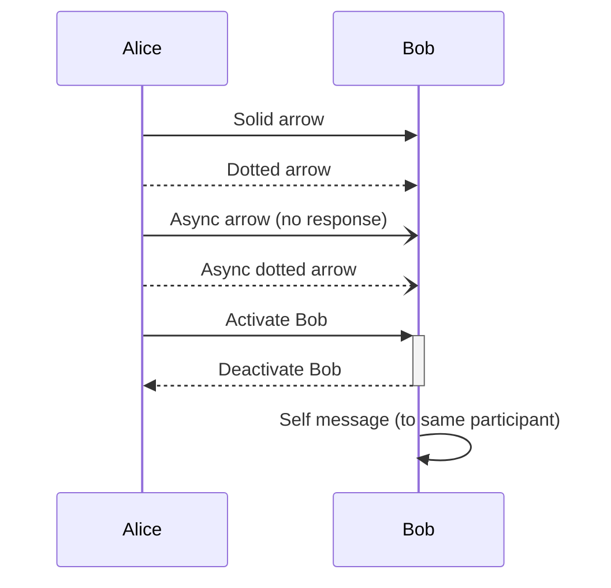
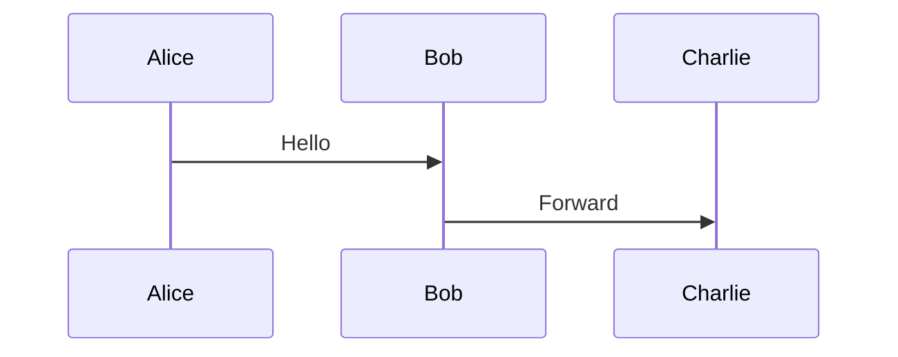
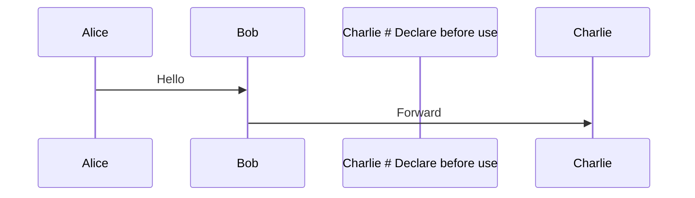

# Mermaid Self-Healing Quick Start Guide

**How to use the self-healing system with your current diagram error**

---

## Current Situation

You have a diagram "On-the-Move Operation and Coverage Exit" that failed to render with this error:

```
Parse error on line 74:
...ide            UE-)>UE: Radio Link Fail
----------------------^
Expecting '+', '-', 'ACTOR', got 'INVALID'
```

The issue: `UE-)>UE` is invalid Mermaid syntax. Should be `UE->>UE` (self-message).

---

## Option 1: Use Self-Healing System (Future - After Implementation)

Once the self-healing system is implemented, this is what will happen automatically:

### Step 1: Error Detection (Automatic)
When the diagram fails to render, the healing modal will appear automatically.

### Step 2: Click "Try to Fix"
The modal will show:
- Error: "Parse error on line 74: UE-)>UE expecting ACTOR"
- Iteration: 0 / 3

### Step 3: Review Proposed Fix
After clicking "Try to Fix", you'll see:
- **Original code:** Shows `UE-)>UE: Radio Link Failure detected`
- **Proposed code:** Shows `UE->>UE: Radio Link Failure detected`
- **Explanation:** "AI proposes fixing invalid_arrow on line 74"
- **Valid examples:** `UE->>UE`, `UE-->>UE`, `UE-)UE`
- **Status:** ✅ "This fix resolves the syntax error!"

### Step 4: Accept Fix
Click "✅ Accept Fix" → Diagram is added to your project with corrected syntax.

---

## Option 2: Manual Fix (Current - Available Now)

Until the self-healing system is implemented, here's how to fix it manually:

### Step 1: Navigate to the Broken Diagram
1. Go to the **Diagrams** tab
2. Find "On-the-Move Operation and Coverage Exit"
3. Click **Edit** button

### Step 2: Find the Error
The error is on line 74. Search for: `UE-)>UE`

You'll find something like:
```mermaid
UE-)>UE: Radio Link Failure detected, start RRC Re-establishment
```

### Step 3: Fix the Syntax
**Change:** `UE-)>UE` (invalid)
**To:** `UE->>UE` (valid self-message)

The corrected line:
```mermaid
UE->>UE: Radio Link Failure detected, start RRC Re-establishment
```

### Step 4: Save
Click **Save** → Diagram should now render correctly.

---

## Implementation Status

The self-healing system is **planned but not yet implemented**. Here's the timeline:

### ✅ What Exists Now:
- Sequential workflow (BRS → Spec → Diagrams) ✅ **COMPLETE**
- Diagram generation from Technical Specification ✅ **WORKING**
- Error detection and display ✅ **WORKING**

### 🚧 What's Being Built (Self-Healing):
- **Phase 1:** Error validation and parsing (1-2 hours)
- **Phase 2:** Mermaid documentation search (2-3 hours)
- **Phase 3:** AI-powered healing logic (3-4 hours)
- **Phase 4:** Interactive healing modal UI (4-5 hours)
- **Phase 5:** Testing and refinement (2-3 hours)

**Total Time:** 12-17 hours of development

---

## Quick Reference: Common Mermaid Syntax Errors

### Invalid Arrow Syntax (Most Common)
❌ **Wrong:** `UE-)>UE` (missing second dash)
✅ **Correct:** `UE->>UE` (solid arrow, self-message)

❌ **Wrong:** `UE->UE` (single dash)
✅ **Correct:** `UE->>UE` (double dash for solid arrow)

❌ **Wrong:** `UE-->UE` (double dash, single arrow)
✅ **Correct:** `UE-->>UE` (double dash, double arrow for dotted)

### Valid Arrow Types in Mermaid Sequence Diagrams:


### Missing Participant Declaration
❌ **Wrong:**


✅ **Correct:**


### Invalid Note Syntax
❌ **Wrong:** `Note Alice: This is a note`
✅ **Correct:** `Note left of Alice: This is a note`

❌ **Wrong:** `Note between Alice Bob: Spanning`
✅ **Correct:** `Note over Alice,Bob: Spanning`

---

## How to Prevent Future Errors

### When Generating Diagrams:

1. **Use Claude Opus or GPT-4** (more reliable syntax)
   - Avoid smaller models for diagram generation
   - Reasoning models (o1, GPT-5) sometimes generate invalid syntax

2. **Enable Approval Workflow** (already active)
   - Review diagrams before applying
   - Check for render errors in preview

3. **Use Templates** (in SequenceDiagramEditor)
   - Start from working examples
   - Modify incrementally

### After Implementation of Self-Healing:

4. **Trust but Verify**
   - Let AI propose fixes
   - Review side-by-side diff
   - Accept if fix looks correct

5. **Learn from Examples**
   - Healing modal shows valid syntax examples
   - Build your Mermaid knowledge over time

---

## Next Steps

### Immediate (Manual Fix):
1. Edit the broken diagram manually (see Option 2 above)
2. Change `UE-)>UE` to `UE->>UE`
3. Save and verify it renders

### Short-term (Implement Self-Healing):
1. Review the implementation plan in [MERMAID_SELF_HEALING.md](MERMAID_SELF_HEALING.md)
2. Decide: Implement now or continue with manual fixes?
3. If implementing: Start with Phase 1 (MermaidValidator.ts)

### Long-term (After Self-Healing):
1. Generate diagrams normally
2. If error occurs → Healing modal appears automatically
3. Click "Try to Fix" → Review → Accept or retry
4. Maximum 3 iterations with user control at each step

---

## FAQ

**Q: Can I use self-healing on existing broken diagrams?**
A: Yes! Once implemented, you'll be able to trigger healing on any diagram with syntax errors, not just newly generated ones.

**Q: Will self-healing work for all Mermaid syntax errors?**
A: It targets ~60-80% of common errors (arrows, participants, notes). Complex semantic errors may still require manual fixes.

**Q: Can I skip healing and edit manually?**
A: Absolutely! The healing modal has an "Edit Manually Instead" button. You're always in control.

**Q: Will healing modify my diagram without asking?**
A: No! Every healing iteration shows you a side-by-side diff and waits for your approval before applying changes.

**Q: What if healing makes things worse?**
A: Click "Reject This Fix" to discard the proposed change and try again with a different approach, or switch to manual editing.

---

## Contact & Feedback

If you encounter Mermaid syntax errors:
1. Try manual fix first (see Option 2)
2. Note the error pattern for self-healing development
3. Report common patterns to improve the embedded documentation

---

**Current Status:** Self-healing system is fully planned and documented. Ready for implementation when approved.
